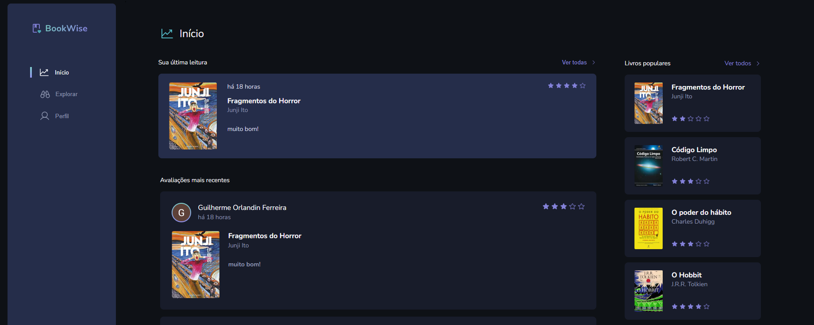

 </div>

## ▶ Preview

[](bookwise-plum.vercel.app)

## 📃 About

Bookwise, é um site de avaliação livros, que foi desenvolvido contando apenas com o design do figma e algumas dicas do notion. O qual o usuário pode fazer login com Google ou Github e fazer suas avaliações dos livros, ver as avaliações de outras pessoas, e também conferir o seus perfis.

## 🎨 Layout

- [Layout Figma - Original](<https://www.figma.com/file/md9BPfKh1RkMnQ6EeQgKyx/BookWise--%E2%80%A2-Desafio-React-(Copy)?type=design&mode=design>)

## 🛠 Build with

- [HTML]()
- [CSS]()
- [TypeScript]()
- [Next]()
- [Next Auth]()
- [React Query]()
- [Prisma]()
- [Stitches]()
- [Radix]()

## 🎞 Demo



## 💻 Getting started

```sh
git clone https://github.com/GuiOrlandin/bookwise.git && cd

bookwise

```
